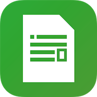

<h1 align="center">RichTexture</h1>

 

## About
RichTexture is a rich text editor for iOS. 

## Running
Open `RichTexture.xcworkspace`, change the bundle identifier to an identifier linked to your Apple developer account in order to run. Build using the `RichTexture` scheme. 

## License

This project is available under the MIT license. See the LICENSE file for more info.
